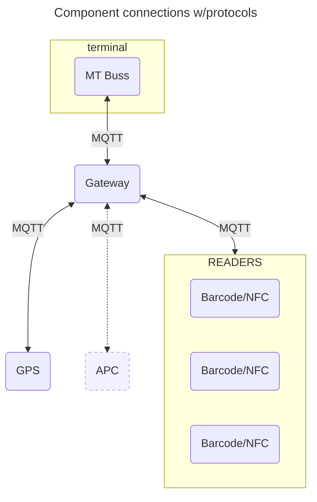
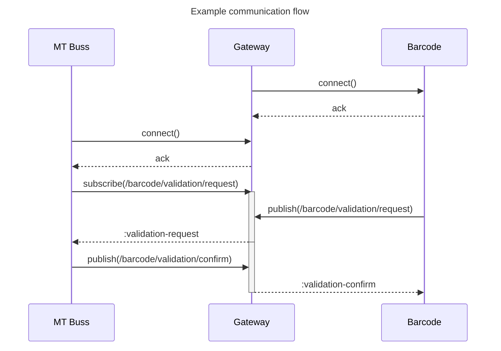

# MT Buss MQTT Validator

This repo contains a test validation client for MQTT communication for hardware devices intended for busses in Møre og Romsdal by FRAM. You can use the code and specification files here to test implementations on hardware or software. See details on running the project as a JSON validator or a MQTT client below.

## MQTT Client

Running the validator and test client as a service connecting to a MQTT Broker (e.g. a hub or gateway in a bus test rig).

## Hardware and Communications

This shows an example component overview as it could be connected in a bus. All protocols here
are MQTT, with the option of multiple Barcode and NFC devices.



The Gateway in this example is the MQTT broker and components and the terminal are producers/consumers.

---

## Communication

The following is a pseudo-example of how the communication will go with message passing using MQTT. All payload will be expected to be JSON. See example models further down in this document.



### Example topics and payloads

The following are examples of what topics and layloads might look like. This will be under continuous change and will be updated as development progresses. For the final source of truth check out the [specifications](./specifications).

#### Topic `/gps/position/`

```json
{
  "atDateTime": "2023-02-06T12:45:50+01:00",
  "position": {
    "latitude": 0,
    "longitude": 0
  }
}
```

#### Topic `/barcode/validation/request/`

```json
{
  "type": "aztec",
  "deviceId": "<id>",
  "code": "<base64-encoded-code>"
}
```
