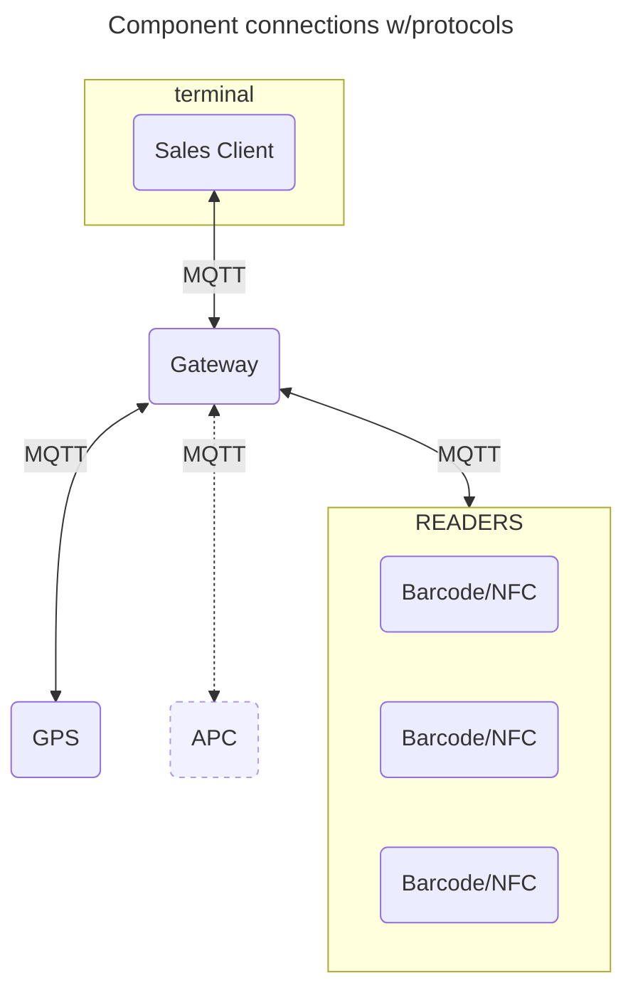
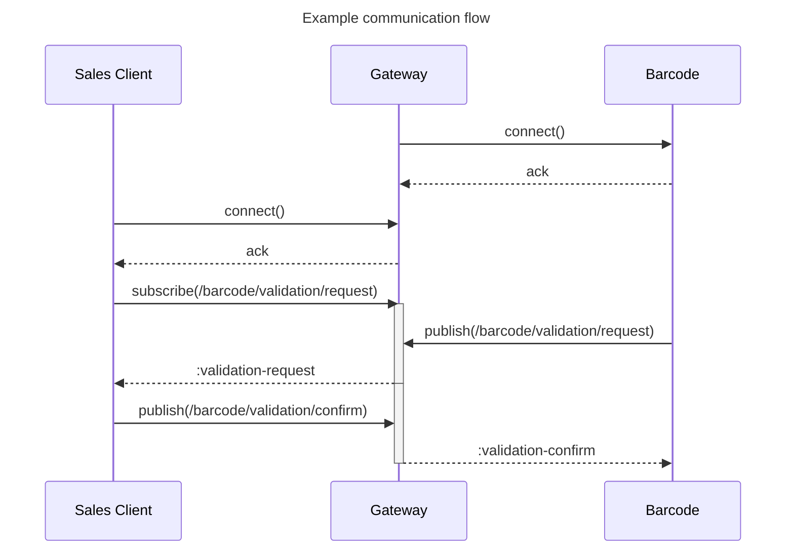

This repo contains specifications for MQTT message exchange (topic + payload)
intended for hardware topologies running in busses using MT Bus client for sales
and validation.

Scope of this specification is primarly for Møre og Romsdal Fylkeskommune and
FRAM, but the overall ambition is for a broad consensus with other operators and
authorities.

## Structure of this repo

In this repo you'll find a test client, CLI validator, documentation page, and
the specification it self.

- All specification and docs found in [/specifications](./specifications/)
- Tools, test clients, cli found in [/packages](./packages/)
- Running web page with specificatiosn is located in
  [/packages/web](./packages/web)

### Topic tree

<pre>
/
├── device
│   ├── [deviceId]
│   │   └── <a href="./specifications/device/[deviceId]/diagnostics/">diagnostics</a>
│   │       └── <a href="./specifications/device/[deviceId]/diagnostics/request/">request</a>
│   └── <a href="./specifications/device/diagnostics/">diagnostics</a>
│       └── <a href="./specifications/device/diagnostics/request/">request</a>
├── sensors
│   └── <a href="./specifications/sensors/location/">location</a>
└── validators
    ├── [deviceId]
    │   ├── <a href="./specifications/validators/%5BdeviceId%5D/configure">configure</a>
    │   │   ├── <a href="./specifications/validators/%5BdeviceId%5D/configure/current">current</a>
    │   │   └── <a href="./specifications/validators/%5BdeviceId%5D/configure/request">request</a>
    │   └── <a href="./specifications/validators/%5BdeviceId%5D/response">response</a>
    ├── <a href="./specifications/validators/barcode/">barcode</a>
    ├── <a href="./specifications/validators/configure">configure</a>
    │   ├── <a href="./specifications/validators/configure/current">current</a>
    │   └── <a href="./specifications/validators/configure/request">request</a>
    └── <a href="./specifications/validators/nfc/">nfc</a>
        └── apdu
            ├── [deviceId]
            │   └── <a href="./specifications/validators/nfc/apdu/[deviceId]/transmit/">transmit</a>
            └── <a href="./specifications/validators/nfc/apdu/receive/">receive</a>
</pre>

## Adding new Specifications

See documentation [specifications/README.md](./specifications/README.md).

## CLI tooling

Given that you have installed Node.js on your system, you can use this package
as a CLI for validationg local JSON-files. See documentation on usage

### Usage

```
Usage: npx @frammr/mqtt-validator -t [topic] -f [file]

Options:
      --version  Show version number                                   [boolean]
  -f, --file     file to validate                                     [required]
  -t, --topic    choose a topic                         [required] [choices: ""]
  -h, --help     Show help                                             [boolean]

Examples:
  Validate foo.json with location specification

    npx @frammr/mqtt-validator -t sensors/gnss/location -f foo.json
```

## MQTT Client

Running the validator and test client as a service connecting to a MQTT Broker
(e.g. a hub or gateway in a bus test rig).

### Requirements

- Node.js 18

### Getting started

```shell
# 1. Get repo
git clone https://github.com/mrfylke/frammr-mqtt-validator.git

# 2. Install dependencies
yarn install

# 3. Copy .env.example and configure
cp ./packages/test-client/.env.example ./packages/test-client/.env
# Edit .env file

# 4. Start MQTT client
yarn run-testclient
```

This will add a subscriber to the Broker as specified in `.env`. You might need
a local test broker also. An alternative might be
[Mosquitto](https://mosquitto.org/).

## Hardware and Communications

This shows an example component overview as it could be connected in a bus. All
protocols here are MQTT, with the option of multiple Barcode and NFC devices.



The Gateway in this example is the MQTT broker and components and the terminal
are producers/consumers.

---

## Communication

The following is a pseudo-example of how the communication will go with message
passing using MQTT. All payload will be expected to be JSON. See example models
further down in this document.



### Example topics and payloads

The following are examples of what topics and layloads might look like. This
will be under continuous change and will be updated as development progresses.
For the final source of truth check out the [specifications](./specifications).

#### Topic `/gps/position/`

```json
{
  "atDateTime": "2023-02-06T12:45:50+01:00",
  "position": {
    "latitude": 0,
    "longitude": 0
  }
}
```

#### Topic `/barcode/validation/request/`

```json
{
  "type": "aztec",
  "deviceId": "<id>",
  "code": "<base64-encoded-code>"
}
```

## Prior work

Other similar work that is used as inspiration.

- Ruter
  - https://ruter.atlassian.net/wiki/spaces/DS/pages/1961689089/Salg+billettering+3.0
  - https://github.com/RuterNo/adt-doc/tree/master/docs/v2.6.0/json-schemas
  - https://github.com/RuterNo/adt-doc
- ITxPT
  - https://wiki.itxpt.org/index.php/S02P10-APC-2_preview#MQTT_parameters
- Samverkansgruppen Validation Services messages
  - https://github.com/mobileticket/vals-schemata
