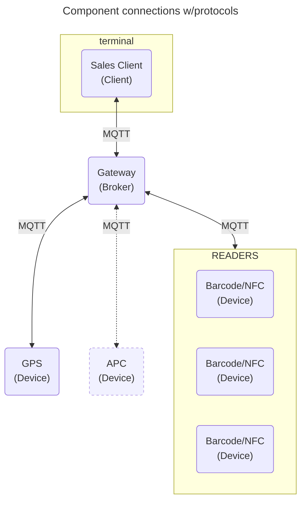

## Hardware topology

All communication happens through a local MQTT Broker, eg. a hardware gateway.
Newer versions of ITxPT also specifies MQTT as a standard way of interacting
with devices.

### Terminology

- **Client**: Sales client used by operators.
- **Broker**: Local running MQTT Broker that relays all messages.
- **Device**: Hardware devices in bus communicating with sales client.
