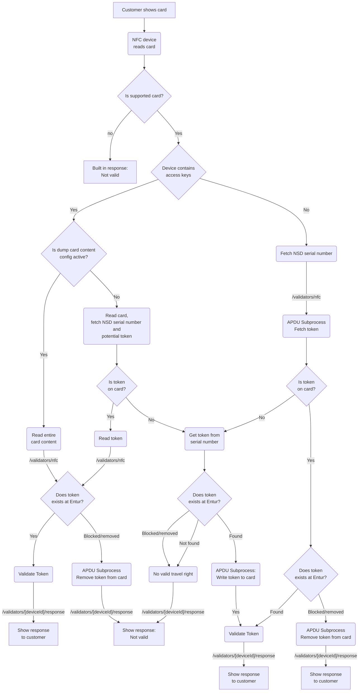

# Specification: nfc

Passenger want to use the service and presents their travelcard that might
contain a token referencing an account containing possible travel rights. If
there is no token, serial number will be used and a potential token on a
customer account with that serial number attached will be written back to the
travel card.

See diagram for total flow.

Token should be transmitted as base64 encoded URL string without padding.

- Topic: `validators/nfc`
- Direction: Publish (Inbound to client)
- JSON Schema: [nfc.schema.json](./nfc.schema.json.json)
- MQTT QoS: 1 (at least once)
- Trigger: Once every time a passenger presents a travel card to the barcode
  reader.

## Card content dump

If device is configured as such the entire card content can be passed from
devices (see flow chart). This will simplify the flow from the client
perspective as it allows you to access content directly. See examples below for
when `cardContent` is set. See topic `validators/configure` for configuration
flag.

This can also be used in cases where the smart card contains different type of
travel rights and when there is a need to prioritize between them (e.g. NOD,
account based, etc).

Only supported type for now is `nsd` and that needs to be set as `type`, for
future proofing when new types are added.

## Examples

```json
{
  "traceId": "543070fe-ef32-11ed-a05b-0242ac120003",
  "deviceId": "flv202400004",
  "eventTimestamp": "2023-04-22T10:28:37.337Z",
  "travelCardNumber": "323116753",
  "token": "CtYBCtMBCtABCiQxNzgzZTk5Ny03YmI0LTRiNDEtYTA5OS03NTk1NTc5Nzg5YWISCwil2JygBhDg15R3GpcBCgQFAwoOEgkIAhIFMS4xLjcSHwgBEhtuby52b3QudHJhdmVsYXNzaXN0YW50LmRlbW8SCwgJEgcyLjE1Ni4xEg0IDBIJMjYwMjE1NjAxEgsIBRIHc2Ftc3VuZxIMCAYSCFNNLUc5ODZCEhQIBxIQYjg2NGMxMWM5OTczNTg3MhIGCAQSAjEzEgYIAxICMzMSBggIEgIyOSIBBBJsCkcwRQIgRkQ0on4VH6WlqnFQa9dQLtfTPanPty4iGg8UALS2mrMCIQD7sajo4AVpurnCcEGbrkFBU7q4dxugiiQtqFijsty85hoBTiIPU0hBMjU2d2l0aEVDRFNBKgsIpdicoAYQ4NeUdzAB"
}
```

### Example with card content

```json
{
  "traceId": "543070fe-ef32-11ed-a05b-0242ac120003",
  "deviceId": "flv202400004",
  "eventTimestamp": "2023-04-22T10:28:37.337Z",
  "travelCardNumber": "323116753",
  "cardContent": [
    {
      "appId": "<ID>",
      "type": "nsd",
      "files": [{ "fileNumber": "<FileNumber>", "content": "0x0032" }]
    }
  ]
}
```

## Flow


