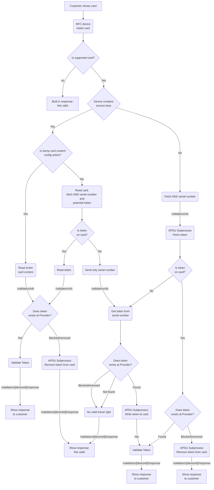

# Specification: nfc

When a passenger intends to use the service, they present their travel card,
which may have a token referencing an account with corresponding travel rights.
In cases where there is no token present, the serial number of the travel card
will be used. If there is a customer account associated with that serial number,
a potential token will be generated and written back to the travel card. See
diagram for total flow.

Token should be transmitted as base64 encoded URL string without padding.

- Topic: `validators/nfc`
- Direction: Publish (Inbound to client)
- JSON Schema: [nfc.schema.json](./nfc.schema.json.json)
- MQTT QoS: 0 (at most once)
- Trigger: Once every time a passenger presents a travel card to the barcode
  reader.

## Card content dump

If the device is configured accordingly, the complete content of the card can be
transferred from the device, as depicted in the flow chart. This simplifies the
client's perspective as it enables direct access to the card's content. Please
refer to the `validators/configure` topic for the configuration flag that
determines whether `cardContent` is set. Below are examples demonstrating the
scenarios when `cardContent` is enabled.

This concept is applicable in situations where the smart card holds various
types of travel rights and there is a requirement to prioritize among them.
Examples of such types include NOD (Nasjonal OrdreDatabase), account-based, and
others.

Only supported type for now is `nsd` and that needs to be set as `type`, for
future proofing when new types are added.

## Examples

```json
{
  "traceId": "543070fe-ef32-11ed-a05b-0242ac120003",
  "deviceId": "flv202400004",
  "eventTimestamp": "2023-04-22T10:28:37.337Z",
  "travelCardNumber": "323116753",
  "token": "CtYBCtMBCtN...VDRFNBKgsIpdicoAYQ4NeUdzAB"
}
```

### Example with card content

```json
{
  "traceId": "543070fe-ef32-11ed-a05b-0242ac120003",
  "deviceId": "flv202400004",
  "eventTimestamp": "2023-04-22T10:28:37.337Z",
  "travelCardNumber": "323116753",
  "cardContent": [
    {
      "appId": "<ID>",
      "type": "nsd",
      "files": [{ "fileNumber": "<FileNumber>", "content": "0x0032" }]
    }
  ]
}
```

## Flow



- The APDU sub-processes are custom command transceive processes that utilize
  the [`apdu`](./apdu/) topics for communication and data exchange.
- In the flow chart, the "Provider" refers to the Account Based Ticketing (ABT)
  provider. This provider handles tasks such as customer data management and
  ticket purchases within the ABT system.
